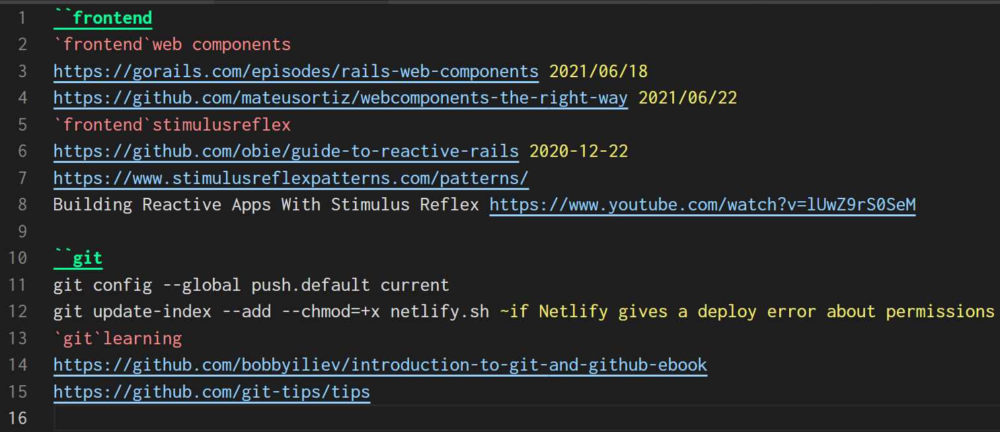

# Supertext

Supertext provides syntax highlighting for writing notes in plain text. For the backstory, see my article [Plain text knowledge base](https://fpsvogel.com/posts/2021/plain-text-knowledge-base).

## Features

The following are highlighted:

`````heading tag```
```tag``
`https://some-url.com`
`~highlighted note`
date: `2021/08/05`
`<<quote or code block — can spread across multiple lines>>` (or `“` and `”`)
divider: ` // ` (or `🙼`)

Example:



## Syntax Settings

To customize the syntax, edit the `.tmLanguage` file in your VS Code extension directory. In Windows that's `C:\Users\[USERNAME]\.vscode\extensions\supertext\syntaxes\supertext.tmLanguage`.

## Color Settings

This extension contributes settings for syntax highlighting colors. To change the colors, simply edit them in VS Code's `settings.json`, under `"editor.tokenColorCustomizations"`. Here are the default settings:

    "editor.tokenColorCustomizations": {
      "textMateRules": [
        {
          "scope": "constant.language.heading-tag.supertext",
          "settings": {
            "foreground": "#00ff9d",
            "fontStyle": "bold underline"
          }
        },
        {
          "scope": "constant.language.tag.supertext",
          "settings": {
            "foreground": "#F38D8D"
          }
        },
        {
          "scope": "constant.language.url.supertext",
          "settings": {
            "foreground": "#98d1ff"
          }
        },
        {
          "scope": "constant.language.note.supertext",
          "settings": {
            "foreground": "#F3ED72"
          }
        },
        {
          "scope": "constant.language.date.supertext",
          "settings": {
            "foreground": "#F3ED72"
          }
        },
        {
          "scope": "constant.language.quote.supertext",
          "settings": {
            "foreground": "#bda385"
          }
        },
        {
          "scope": "constant.language.divider.supertext",
          "settings": {
            "foreground": "#4aff40"
          }
        },
        {
          "scope": "text.supertext",
          "settings": {
            "foreground": "#DBDBDB"
          }
        }
      ]
    }

## Release Notes

### 1.0.0

Initial release of Supertext.
